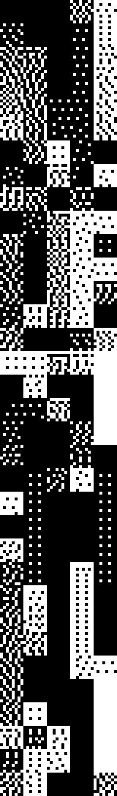
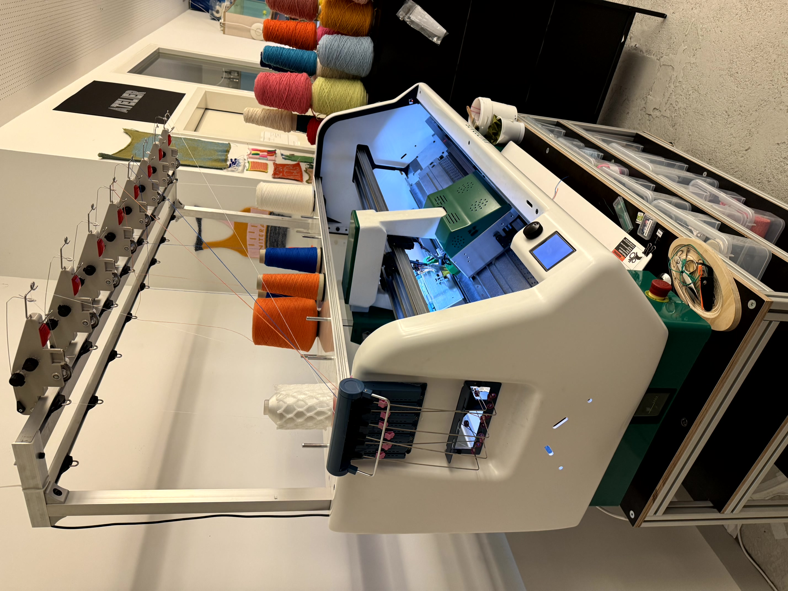
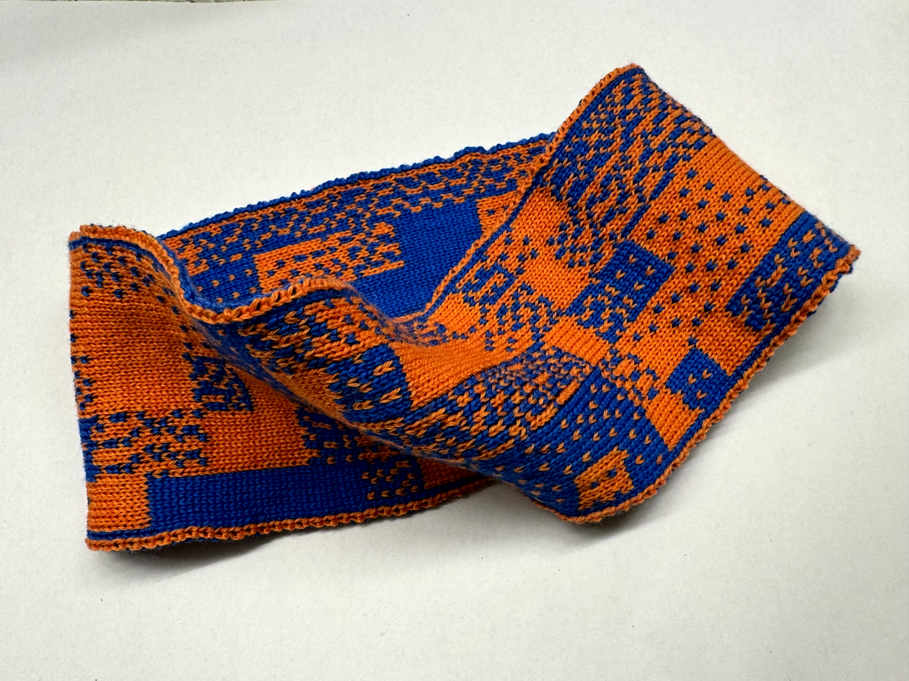
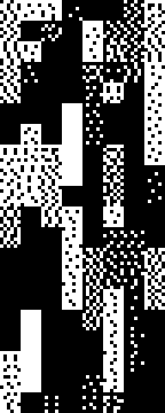
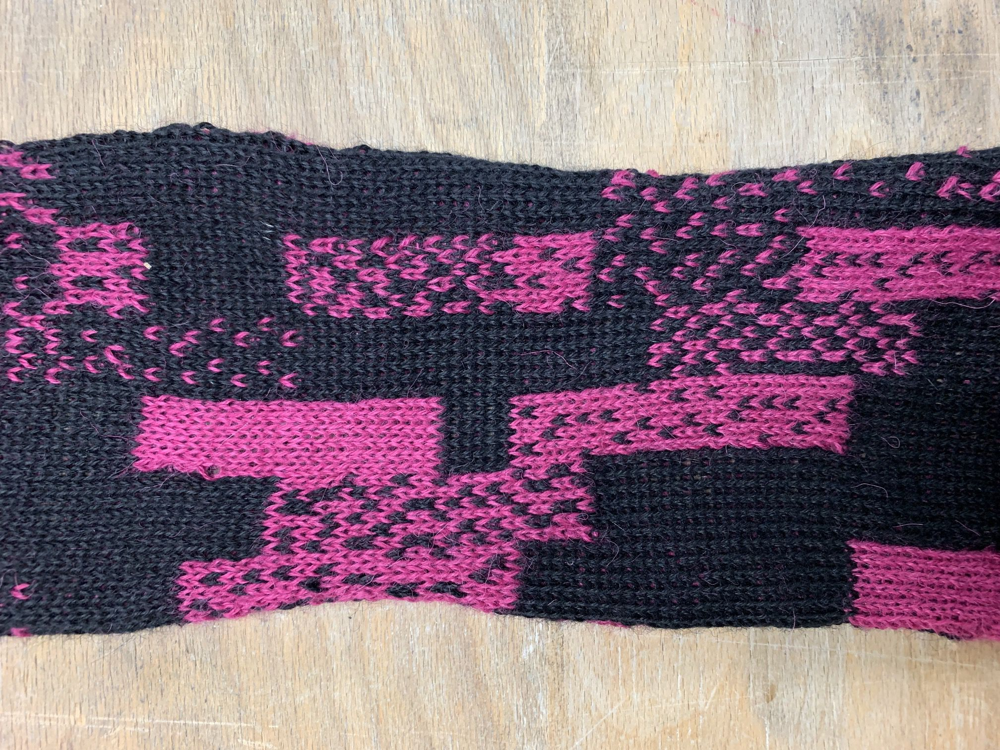
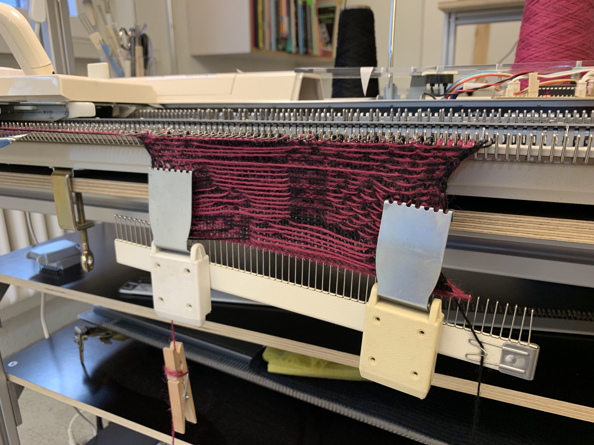

# Dither Generator

Generation of dither patterns.

## Knitting

The Patterns are developed for Knitting

### Test with Kniterate

April 2024

```js
let config = {
  width: 5, // block width
  height: 34, // block height
  pixelWidth: 8, // each blocks is 8 × 8px
  upscaleFactor: 1, // the resulting image
  seed: 134, // seed for random generator
  colorFactor: 0.75, // darken the overall color
};
```



### Results




### Test with Brother KH-940 Knitting Machine

April 2019

```js
let config = {
  width: 8, // block width
  height: 20, // block height
  pixelWidth: 6, // each blocks is 6 × 6px
  upscaleFactor: 1, // the resulting image
  seed: 44, // seed for random generator
  colorFactor: 0.75, // darken the overall color
};
```



### Results



