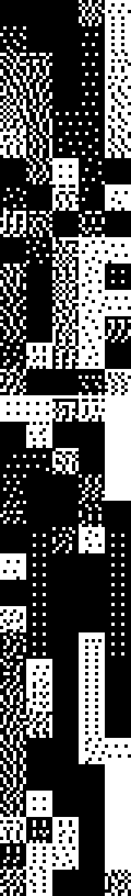
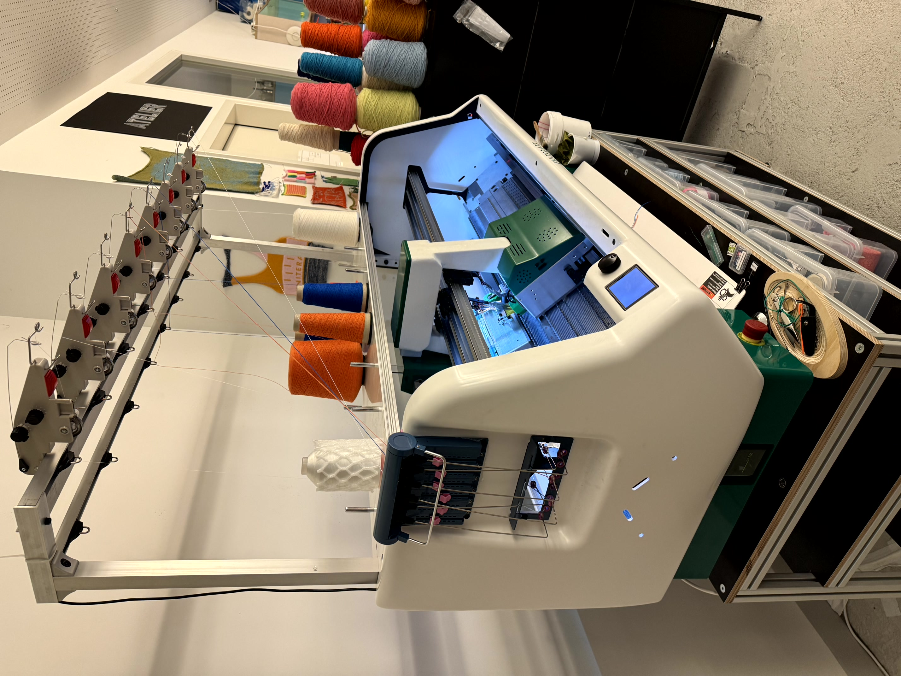
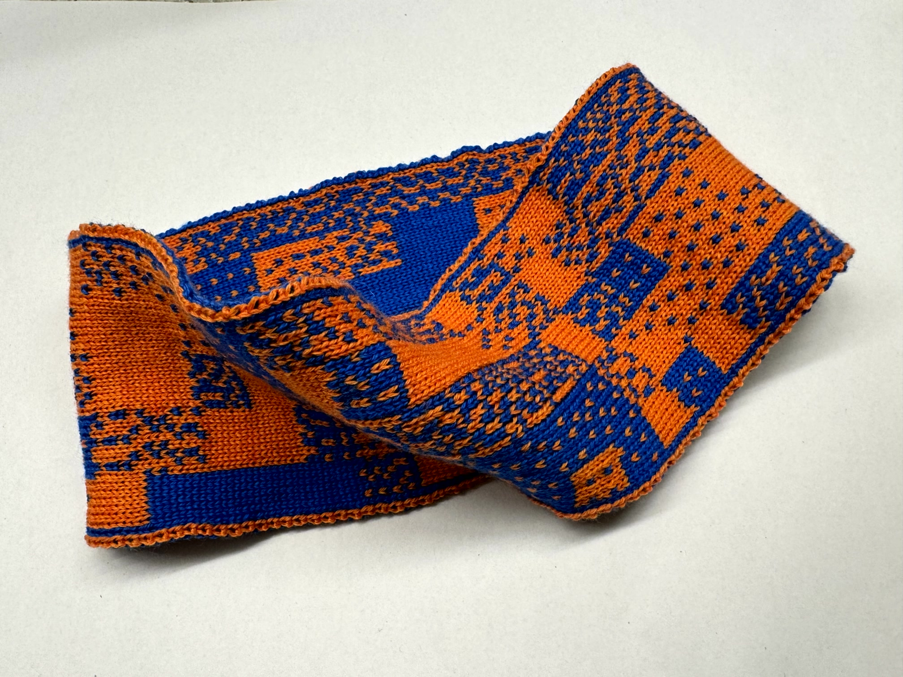
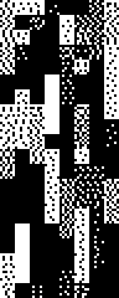
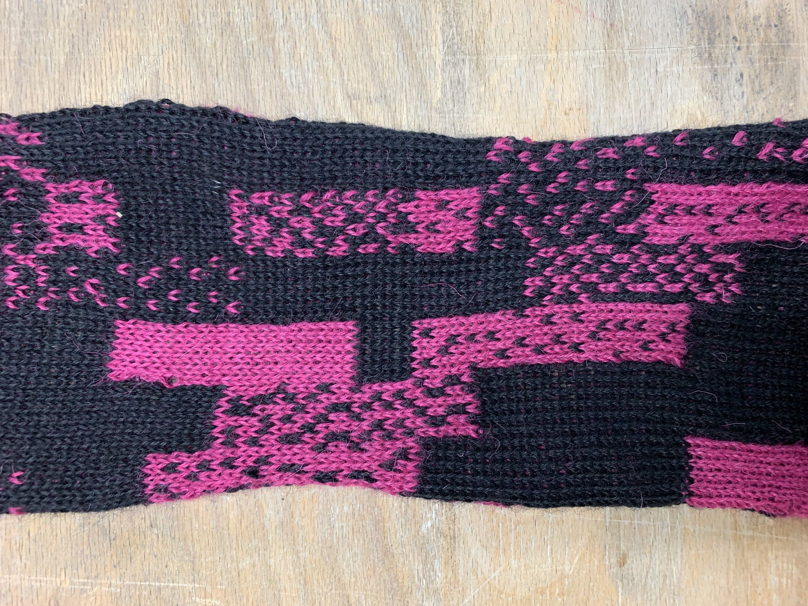
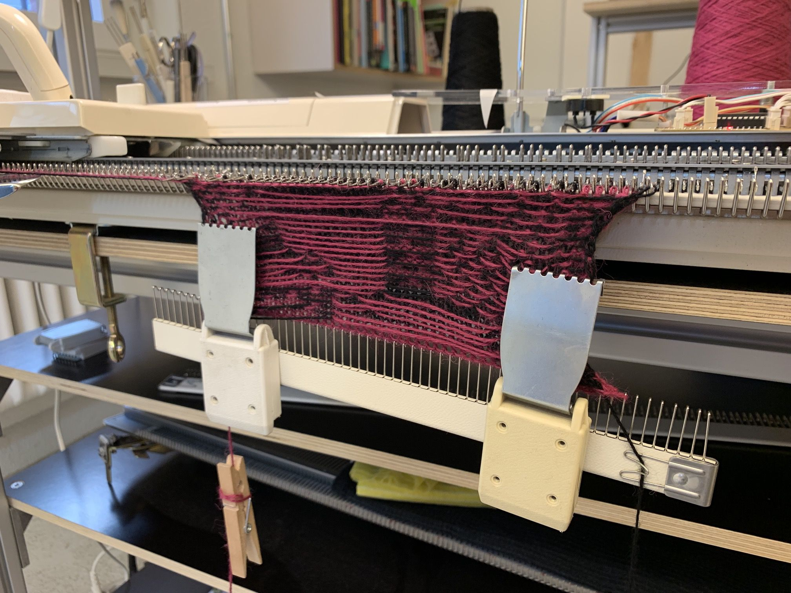

# Dither Generator

Generation of dither patterns.

## Knitting

The patterns are developed for knitting.

### Test with Kniterate

April 2024 (original generator)

```txt
width=5
height=34
seed=134
scale=8
curve=0-0--100-75
colorDistanceFormula=Euclidean
imageQuantization=Jarvis
palette=000000--ffffff
```



### Results




### Test with Brother KH-940 Knitting Machine

April 2019 (original generator)

```txt
width=8
height=20
seed=44
scale=6
curve=0-0--100-75
colorDistanceFormula=Euclidean
imageQuantization=Jarvis
palette=000000--ffffff
```



### Results



